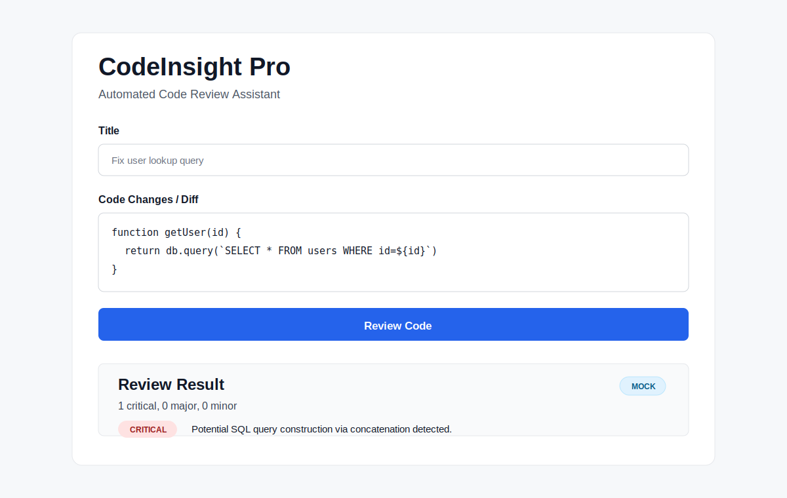
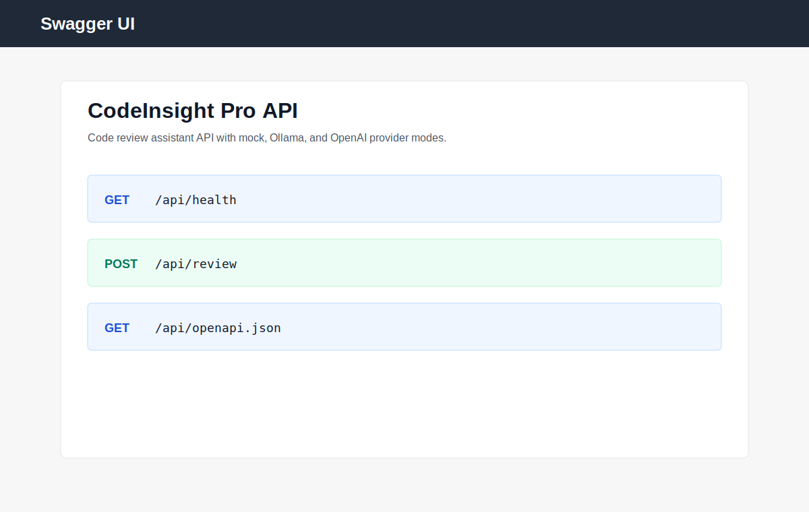
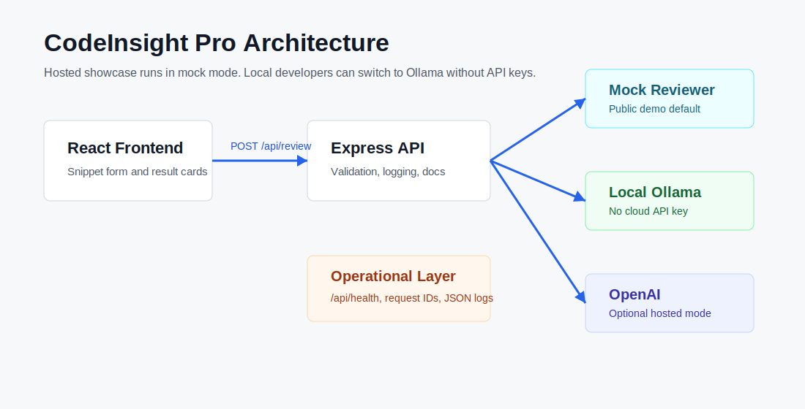

# CodeInsight Pro

> A deployable code review assistant that analyzes pasted code or pull request diffs and returns structured feedback for security, reliability, readability, and maintainability.

[](https://nodejs.org)
[](https://react.dev)
[](https://github.com/parthshah27/codeinsight-pro/actions/workflows/ci.yml)
[](LICENSE)
[](https://codeinsight-pro.onrender.com/)

Live demo: https://codeinsight-pro.onrender.com/

Swagger docs: https://codeinsight-pro.onrender.com/api/docs

OpenAPI JSON: https://codeinsight-pro.onrender.com/api/openapi.json

Health check: https://codeinsight-pro.onrender.com/api/health

## Screenshots





## Why This Project Looks Production-Ready

CodeInsight Pro is built as a portfolio-friendly system rather than a hardcoded API-key demo. The hosted deployment runs safely in deterministic mock mode, while local developers can switch to Ollama or OpenAI through environment configuration.

- Public demo works without paid credentials.
- Local Ollama mode supports private, no-cloud inference.
- OpenAI mode is available for higher-quality hosted reviews.
- API responses are structured and frontend-friendly.
- Swagger UI and OpenAPI JSON are served by the backend.
- Health checks, request IDs, JSON logging, validation, and consistent error responses are included.
- Render deployment is configured with `render.yaml`.
- GitHub Actions checks frontend build and backend syntax.

## Architecture



Request flow:

1. The React frontend submits code to `POST /api/review`.
2. Express validates the request, attaches a request ID, and logs the request lifecycle.
3. The provider adapter routes the prompt to `mock`, `ollama`, or `openai`.
4. The API returns structured findings or provider-generated review text.
5. The frontend renders summaries, severity badges, and suggestions.

## Provider Modes

| Mode | Best for | Requires API key | Notes |
| --- | --- | --- | --- |
| `mock` | Public portfolio deployment | No | Deterministic heuristic findings. Used on Render. |
| `ollama` | Local private development | No | Requires local Ollama server on `localhost:11434`. |
| `openai` | Higher-quality hosted reviews | Yes | Requires `OPENAI_API_KEY`. |

Backend `.env` example:

```bash
AI_PROVIDER=mock
OLLAMA_BASE_URL=http://localhost:11434
OLLAMA_MODEL=deepseek-coder
# OPENAI_API_KEY=your_openai_api_key_here
```

## Features

- Snippet and diff review from a browser UI.
- Mock review engine for no-key public demos.
- Local Ollama integration for private developer workflows.
- Optional OpenAI provider path.
- Severity labels: `critical`, `major`, `minor`, `info`.
- Swagger UI at `/api/docs`.
- OpenAPI JSON at `/api/openapi.json`.
- Health endpoint at `/api/health`.
- Request logging with request IDs.
- Consistent JSON error format.
- Single-service Render deployment.

## API Quick Demo

```bash
curl -X POST https://codeinsight-pro.onrender.com/api/review \
  -H "Content-Type: application/json" \
  -d '{
    "title": "Fix user lookup",
    "description": "Review this database access change.",
    "codeSnippet": "function getUser(id) { return db.query(`SELECT * FROM users WHERE id=${id}`) }"
  }'
```

Example response:

```json
{
  "review": {
    "mode": "mock",
    "summary": "1 critical, 0 major, 0 minor",
    "findings": [
      {
        "severity": "critical",
        "category": "security",
        "message": "Potential SQL query construction via concatenation detected.",
        "suggestion": "Use parameterized queries/prepared statements instead of concatenating user input."
      }
    ]
  }
}
```

More examples are in [docs/demo-snippets.md](docs/demo-snippets.md).

Full API reference is in [docs/api.md](docs/api.md).

## Health, Logging, and Errors

Health endpoint:

```bash
curl https://codeinsight-pro.onrender.com/api/health
```

Typical health response:

```json
{
  "ok": true,
  "provider": "mock",
  "uptimeSeconds": 120,
  "startedAt": "2026-05-11T12:00:00.000Z"
}
```

Every request receives an `x-request-id` response header and is logged as a JSON event with method, path, status, and duration.

Error format:

```json
{
  "error": {
    "code": "INVALID_CODE_SNIPPET",
    "message": "codeSnippet is required and must be a non-empty string.",
    "requestId": "lxi7rs-abc123"
  }
}
```

## Local Development

Install frontend dependencies:

```bash
cd frontend
npm install
npm start
```

Install backend dependencies:

```bash
cd backend
npm install
npm start
```

Local URLs:

- Frontend: `http://localhost:3000`
- Backend: `http://localhost:5000`
- API docs: `http://localhost:5000/api/docs`

## Local Ollama Mode

Install Ollama and pull a model:

```bash
ollama serve
ollama pull deepseek-coder
```

Set backend environment:

```bash
AI_PROVIDER=ollama
OLLAMA_BASE_URL=http://localhost:11434
OLLAMA_MODEL=deepseek-coder
```

Ollama mode does not need signup, billing, or cloud API keys.

## Deployment

The included `render.yaml` deploys the app as one Render web service:

```bash
cd frontend && npm ci && npm run build && cd ../backend && npm ci
cd backend && npm start
```

Express serves the production React build and API from the same domain, so there is no hosted frontend/backend URL mismatch.

See [DEPLOYMENT.md](DEPLOYMENT.md) for step-by-step Render instructions.

## CI/CD

GitHub Actions runs on pushes and pull requests:

- install frontend dependencies
- build the React app
- install backend dependencies
- run `node --check backend/server.js`

Workflow: [.github/workflows/ci.yml](.github/workflows/ci.yml)

## Tech Stack

| Layer | Technology |
| --- | --- |
| Frontend | React 18, Axios |
| Backend | Node.js 20, Express |
| API docs | OpenAPI JSON, Swagger UI |
| Providers | Mock, Ollama, OpenAI |
| Hosting | Render |
| CI | GitHub Actions |

## Roadmap

- GitHub PR URL ingestion.
- GitHub App that comments on pull requests.
- Per-repo severity rules.
- Authentication for team dashboards.
- Historical review analytics.

## License

MIT. See [LICENSE](LICENSE).

## Author

Built by [Parth Shah](https://github.com/parthshah27), backend developer focused on Node.js, AWS, and scalable systems.
